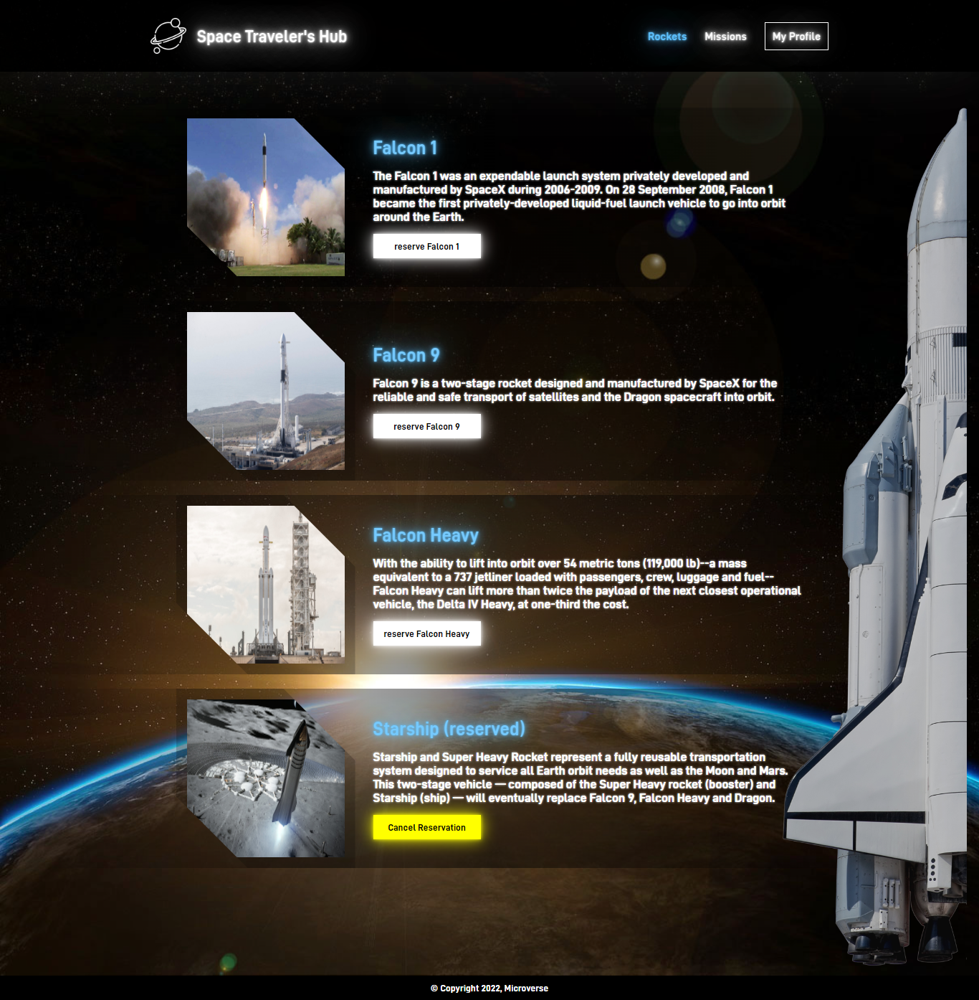
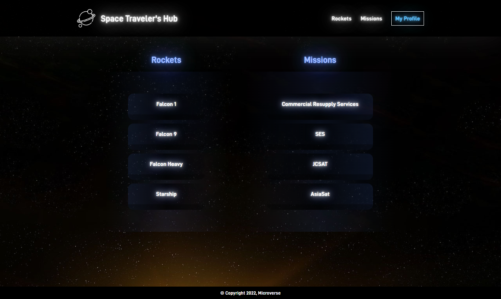

  
# Space Traveler's Hub: 🚀🚀🚀
- Microverse - React/Redux group project

## Acces link
> [click here to check live version](https://spacetraveler-guedeskatana.netlify.app/MyProfile)

## Tech ⌘⇧
- **HTML & CSS best practices:** Correct use of tags, elements, properties and syntax.
- **Gitflow:**  Correct use of Branches for deployment and features development.
- **REACT:**  Used to set the basic structure.
- **REDUX:** Centralizing application's state.
- **API:** Fetching data.
- **Webpack:**  Source development for production bundling.
- **Linters Check:** Local and Pull Request Github workflows to check for stylistic errors, bugs and syntax errors in code.

## Quick view
> 
> 

## Setup

- Use the following link for "$ git clone" the repo:
https://github.com/Vitor-Guedes-Madeira/Space-Traveler/
- cd Space-Traveler
- "npm install" to install all the dependencies
- "npm start" to run the live version locally
- "code ." To open the project on your local editor

- Please click on the "acess link" so you can view the live demo
- You can use it for functional math-related quotes and calculation

## Authors

👤 **Vitor Guedes Madeira**
- GitHub: [@vitorguedesmadeira](https://github.com/VitorGuedesMadeira)
- Twitter: [@CDahguedes](https://twitter.com/CDahguedes)
- LinkedIn: (https://www.linkedin.com/in/vitor-guedes-madeira/)

👤 **Davis Katana**
- GitHub: [@DavyKn](https://github.com/DavyKn)
- Twitter: [@davnyale](https://twitter.com/davnyale)
- LinkedIn: (https://www.linkedin.com/in/davis-nyale/)

## 🤝 Contributing

Contributions, issues, and feature requests are welcome!

Feel free to check the [issues page](../../issues/).

## Show your support

Give a ⭐️ if you like this project!

## Acknowledgments

- Hat tip to anyone whose code was used
- Inspiration
- etc

## 📝 License

This project is [MIT](./MIT.md) licensed.